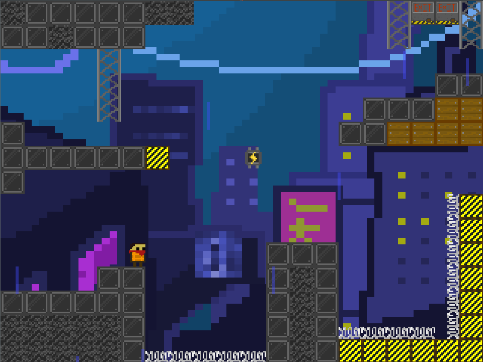
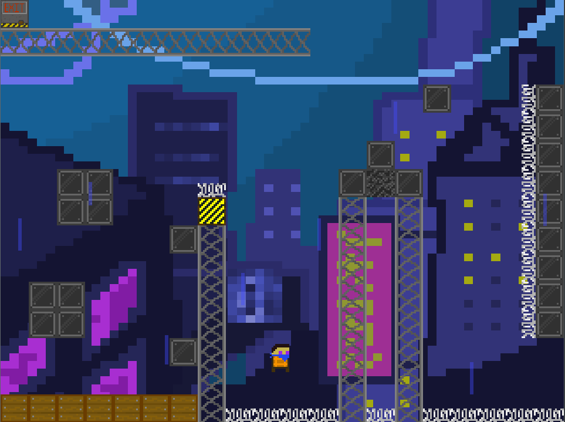

# Lambda Ledge

Lambda Ledge is a 2D-platformer, where the player's goal is simple: **get to the exit**

## Screenshots

&nbsp

## Installation 
Clone the repository and `cd` into it. Run `make start` to begin playing. 

## Controls

| Gameplay   | Keys           |
|------------|----------------|
| Move Left  |  ←             |
| Move Right |  ←             |
| Move Up    |  ↑             |
| Move Down  |  ↓             |
| Jump       | <kbd>c</kbd>   |
| Dash       | <kbd>x</kbd>   |
| Quit       | <kbd>q</kbd>   |

